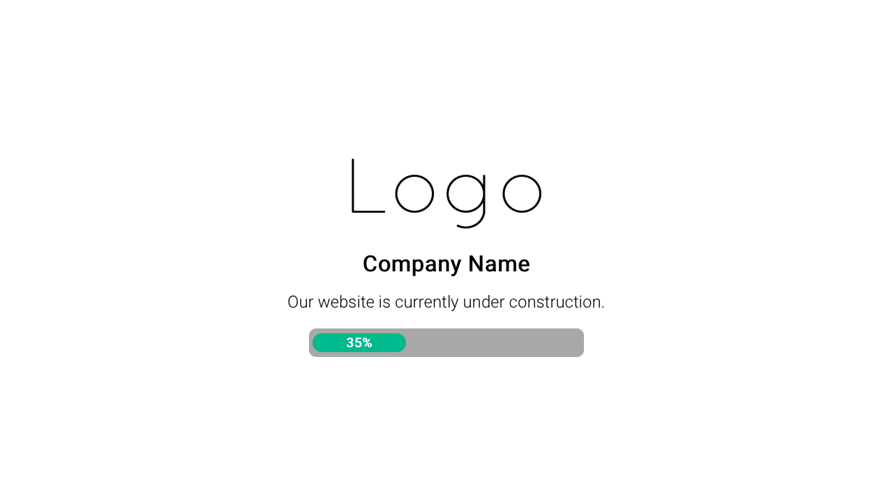

Coming Soon
===========

Coming Soon is a simplistic, animated and responsive "coming soon" angular app.
Based on the work of  [Steven Tang YC](https://github.com/YC/coming-soon)

Features:

- The coming-soon page is located in a feature module
- Default page is the above mentioned module, if you need to change it, please edit the [app-routing-module](src/app/app-routing.module.ts)

Deploy to github:

- Fork and make your changes locally
- ng build --prod --output-path docs --base-href /<your_project_name_on_github>/
- When the build is complete, make a copy of docs/index.html and name it docs/404.html
- Commit your changes and push
- On the GitHub project page, configure it to publish from the docs folder as described [here](https://help.github.com/en/github/working-with-github-pages/configuring-a-publishing-source-for-your-github-pages-site#publishing-your-github-pages-site-from-a-docs-folder-on-your-master-branch)

The project is deployed [here](https://s0l0c0ding.github.io/coming-soon/
)

